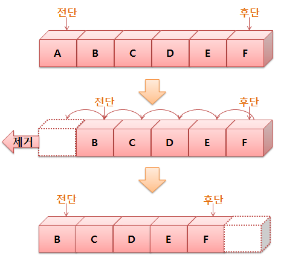

# Stack, Queue

## 자료구조
Data의 집합. 정의된 규칙으로 인해 나열되고 자료에 대한 처리를 효율적으로 수행할 수 있도록
자료를 구분하여 표현한 것.

자료를 효율적으로 저장하고, 관리하기 때문에 잘 선택된 자료구조는 실행시간을 단축시켜주거나 메모리 용량의 절약이 가능


## 스택
자료의 입력과 출력을 한 곳으로 제한한 자료구조
LIFO (Last in First Out) 구조, push() pop()

**Stack**
```js
var third = function(){
  console.log('third');
}
var second = function(){
  third();
  console.log('second');
}
var first = function(){
  second();
  console.log('first');
}
first();
third();
// third > second > first > third 순으로 console이 찍히게 된다.
```


**Linked List Stack**

위의 구현한 스택은 문제점이 존재한다. 배열처럼 스택의 용량을 정해두고 데이터를 쌓아야만 함.
스택의 용량을 초과할 경우 위에 있는 데이터를 빼내야만 다른 데이터를 넣을 수 있음.


```js
var Stack = (function(){
  var Stack = function(){
    this.dataStore = []; // 데이터들을 넣어줄 공간
    this.top = 0; // 초기에는 쌓인 값이 없으니 0으로 초기화해줍니다.
  };
  Stack.prototype.push = function(data){
    this.dataStore[this.top++] = data;
  };
  Stack.prototype.pop = function(){
    return this.dataStore[--this.top];
  };
  Stack.prototype.length = function(){
    return this.top; // top 반환
  };
  Stack.prototype.clear = function(){
    this.top = 0;
  };
  // 다 만들었으니 동작이 잘하는지 살펴봐야겠죠?
  var stack = new Stack();
  stack.push(1);
  stack.push(2);
  stack.push(3);  
  console.log('요소제거', stack.pop()); // 3
  console.log('length', stack.length()); // 2 
  stack.clear();
  console.log('length', stack.length()); // 0
  return Stack;
})();
```


**장점**
- 크기에 제한을 가지고 있지 않다.
- 중간 삽입, 삭제가 array에 비하여 쉽다.
- 삽입, 삭제에 대한 비용이 적다. O(1)
- 때문에 c,c++ 등에서 자료구조를 구현할때 linked list를 주로 활용한다.

**단점**
- 탐색에 있어서 단방향이다.
- 탐색에 대하여 비용이 크다. O(n)
- 때문에 삽입,삭제 에 있어서 이전 노드의 주소(객체)의 정보를 가지고 있어야 한다.
- 이중 연결 리스트가 방안이 될 수 있다.


## 큐
자료의 입력과 출력을 한 쪽 끝으로 제한한 자료구조
FIFO (First in First Out) 구조, put() get()

tree의 깊이 우선탐색, sliding window 등 주로 순서 처리의 시스템에 쓰인다.

처리될 메세지들의 리스트.
스택이 비어있으면 큐에서 하나의 메세지가 꺼내지고 처리가 됨. 




**단점**
- 큐에 빈 메모리가 남아 있어도 꽉 차있는 것으로 판단할 수 있음. rear가 배열의 끝에 도달했을 경우

> 개선된 원형 큐가 나옴

**원형 큐의 단점**
- 메모리 공간은 잘 활용하나 배열로 구현되어 있기 때문에 큐의 크기가 제한이 되는 단점이 존재

> 링크드 리스트로 큐가 나옴

링크드 리스트로 구현한 큐는 큐의 제한이 없고 삽입, 삭제가 편리하다


```js
 var queue = function(){
  this.datas = [];
 }

 queue.prototype.isEmpty = function(){
   return this.datas.length==0?true:false;
 }
 queue.prototype.length = function(){
  return this.datas.length;
 }
 queue.prototype.enqueue = function(element){
  this.datas.push(element);
  // console.log("-------------------------------------------------------------");
  // console.log("enqueue ",element);
  // console.log("-------------------------------------------------------------");
  this.print();

 }
 queue.prototype.dequeue = function(){
  element = this.peek();
  this.datas.shift();
  // console.log("-------------------------------------------------------------");
  // console.log("dequeue, return ",element);
  // console.log("-------------------------------------------------------------");
  // this.print();
  return element;
 }
 queue.prototype.peek = function(){
  element = this.datas[0]==undefined?null:this.datas[0];
  return element;
 }
 queue.prototype.toArray = function(){
  return this.datas;
 }
 queue.prototype.print = function(){
  console.log(this.datas);
 }

 queue.prototype.delAll = function(){
  this.dats = [];
 }

 // Q = new queue();

 // Q.enqueue(5);
 // Q.enqueue(3);
 // Q.dequeue();
 // Q.enqueue(8);
 // Q.enqueue(7);
 // Q.dequeue();
 // Q.enqueue(9);
 // Q.enqueue(10);
 // Q.dequeue();

 module.exports = queue;
```


