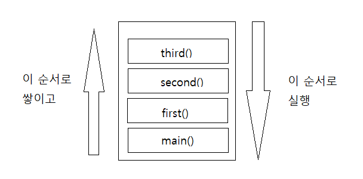
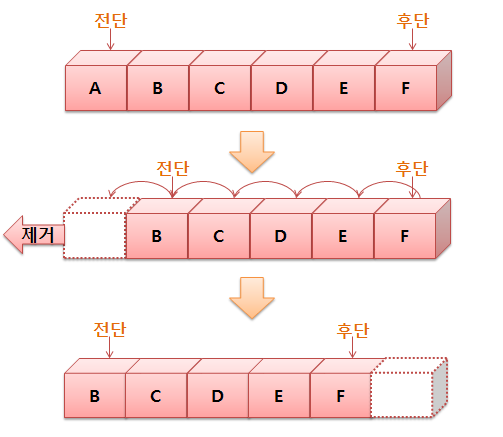

# Stack, Queue

## 자료구조

Data 의 집합. 정의된 규칙으로 인해 나열되고 자료에 대한 처리를 효율적으로 수행할 수 있도록 자료를 구분하여 표현한 것.

자료를 효율적으로 저장하고, 관리하기 때문에 잘 선택된 자료구조는 실행시간을 단축시켜주거나 메모리 용량의 절약이 가능

---

## 스택

자료의 입력과 출력을 한 곳으로 제한한 자료구조

LIFO (Last in First Out)

**Stack**

스택은 가장 윗부분에서만 자료를 추가와 삭제가 일어나므로 실행속도가 빠르고 구현이 쉬운 효율적인 자료구조



```js
var third = function() {
  console.log("third");
};
var second = function() {
  third();
  console.log("second");
};
var first = function() {
  second();
  console.log("first");
};
first();
third();
```

> log 의 결과값이 third > second > first > third 순으로 찍히게 된다.

---

스택을 사용해야할 때 주의해야할 점은 **UnderFlow**와 **OverFlow**.

**UnderFlow:** top 이 이미 초기값을 가르키고 있어 스택에 아무것도 없는상태에서 pop() 연산을 시도할때 발생.

**OverFlow:** top 이 스택의 최대값을 가르키고 있는 상태에서 push() 연산을 시도할때 발생.

배열처럼 스택의 용량을 정해두고 데이터를 쌓아야만 함.

스택의 용량을 초과할 경우 위에 있는 데이터를 빼내야만 다른 데이터를 넣을 수 있음.


```js
function Stack() {
  this.dataStore = []; // 요소 저장공간
  this.top = -1; //스택의 위치
  this.push = push; // 스택에 요소를 추가
  this.pop = pop; // 스택에 요소를 제거
  this.peek = peek; // 최상의 요소 출력
  this.clear = clear; // 모든 요소 제거
  this.length = length; // 스택의 길이를 반환
}

//스택에 요소를 추가
function push(element) {
  this.top = this.top + 1;
  this.dataStore[this.top] = element;
}

//스택의 꼭대기의 요소를 반환한다.
//단 top이 감소하는것은 아니다.
function peek() {
  return this.dataStore[this.top];
}

//스택 최상층의 요소를 반환한다.
function pop() {
  //Stack underflow
  if (this.top <= -1) {
    console.log("Stack underflow!!!");
    return;
  } else {
    var popped = this.dataStore[this.top];
    //top을 1 감소시킨다.
    this.top = this.top - 1;
    return popped;
  }
}

//스택의 전체 요소를 삭제한다.
function clear() {
  this.top = -1;
}

//스택에 저장된 데이터 수
function length() {
  return this.top + 1;
}

var stackObj = new Stack();

stackObj.push("David");
stackObj.push("Raymond");
stackObj.push("Bryan");

//스택의 크기 반환
console.log("length: " + stackObj.length()); // 3

//스택 최상위 요소 출력
console.log(stackObj.peek()); // Bryan

//스택에서 최상위 요소 꺼내기
var popped = stackObj.pop();
console.log("The popped element is: " + popped); // Bryan

//스택의 최상위 요소 출력
console.log(stackObj.peek()); // Raymond

//스택에 데이터 삽입
stackObj.push("Cynthia");

//스택의 최상위 요소 출력
console.log(stackObj.peek()); // Cynthia

//스택 비우기
stackObj.clear();

//스택의 크기 반환
console.log("length: " + stackObj.length()); // 0

//스택의 최상위 요소를 출력.
//이때 스택은 모두 비워졌으므로 undefined가 출력된다.
console.log(stackObj.peek()); // undefined

//스택에 데이터 삽입
stackObj.push("Clayton");

//스택의 최상위 요소 출력
console.log(stackObj.peek()); // Clayton
```

### 재귀
```js
// 일반적인 팩토리얼 구현 함수
function factorial(n) {
  if( n < 2 ) {
      return 1;
  }else {
      return n * factorial(n-1);
  }
}

// 스택을 이용한 팩토리얼 구현 함수
function fact(n) {
  var stack = new Stack();
  while ( n > 1 ) {
      stack.push(n--);
  }

  var result = 1;
  while( stack.length() > 0 ) {
      result *= stack.pop();
  }
  return result;
}
```

---

## 큐

자료의 입력과 출력을 한 쪽 끝으로 제한한 자료구조

FIFO (First in First Out)

주로 tree 의 깊이 우선탐색, 프린트 스풀러, 은행 고객이나 식료품상점의 대기줄 등 주로 순서 처리의 시스템에 쓰인다.





```js
function Queue() {
  this.dataStore = []; // 요소 저장공간
  this.enqueue = enqueue; // 요소추가
  this.dequeue = dequeue; // 요소꺼내기
  this.front = front; // 큐의 맨 앞에 있는 요소 확인
  this.back = back; // 큐의 맨 뒤에 있는 요소 확인
  this.toString = toString; // 모든 요소 출력
  this.empty = empty; // 큐가 비었는지 안비었는지 알려줌
}

function enqueue(element) {
  //여기서 push함수는 Array의 내장함수이다.
  //요소를 배열 맨 뒤에 삽입.
  this.dataStore.push(element);
}

function dequeue() {
  //shift는 Array의 내장함수이다.
  //배열내의 맨 앞 요소를 반환하고 배열내에서 삭제한다.
  return this.dataStore.shift();
}

//큐의 맨 젓번째 요소 반환
function front() {
  //배열의 첫번째 요소 반환
  return this.dataStore[0];
}

//큐의 맨 끝 요소 반환
function back() {
  //배열의 맨 끝 요소 반환
  return this.dataStore[this.dataStore.length - 1];
}

//큐에 저장된 요소 모두 출력
function toString() {
  var retStr = "";
  for (var i = 0; i < this.dataStore.length; i++) {
    retStr = retStr + this.dataStore[i] + "\n";
  }
  return retStr;
}

//큐 비우기
function empty() {
  if (this.dataStore.length == 0) {
    return true;
  } else {
    return false;
  }
}

var queueObject = new Queue();

//Queue에 요소 삽입
queueObject.enqueue("Meredith");
queueObject.enqueue("Cynthia");
queueObject.enqueue("Jennifer");

//First In First Out - 먼저들어간게 먼저나오는 구조로 인하여
//Meredith가 먼저 나온다.
console.log("Dequeued elemet: " + queueObject.dequeue()); // Meredith

//Queue의 모든 요소 출력
console.log(queueObject.toString()); // Cynthia, Jennifer

//큐의 맨 앞의 요소 출력
console.log("Front of queue : " + queueObject.front()); // Cynthia

//큐의 맨 뒤 요소 출력
console.log("Back of queue : " + queueObject.back()); // Jennifer
```

### 우선순위 큐
```js
function Patient(name, code) {
  this.name = name;
  this.code = code; // 우선순위 요소를 나타내는 정수
}

function dequeue() {
  // 가장 낮은 우선순위 코드를 가진 요소가 가장 높은 우선순위를 갖는다.
  // 배열을 둘러보면서 가장 낮은 우선순위 코드를 찾고 splice를 이용해 우선순위가 가장 높은 요소를 삭제한다.
  var entry = 0;
  for (var i = 0; i < this.dataStore.length; ++i) {
    if (this.dataStore[i].code < this.dataStore[entry].code) {
      entry = i;
    }
  }
  // 단순 순차검색 방법으로 우선순위가 가장 높은 코드 (가장 낮은 code. 1이 5보다 높은 우선순위를 갖는다)를 찾음
  return this.dataStore.splice(entry, 1);
}

// 위에서 수정한 dequeue를 제대로 출력하는 함수
function toString() {
  var retStr = '';
  for(var i = 0; i < this.dataStore.length; ++i) {
    retStr += this.dataStore[i].name + ' code: '
           + this.dataStore[i].code + '\n';
  }
  return retStr
}


```


## 자료 참고
- [자바스크립트 자로구조와 알고리즘](http://book.naver.com/bookdb/book_detail.nhn?bid=8095174)
- [[자료구조 강좌 - 큐] -   블로그](http://blog.eairship.kr/213)
- [[data structure javascript] Stack - 블로그](http://mythinkg.blogspot.com/2015/04/data-structure-javascript-stack.html)